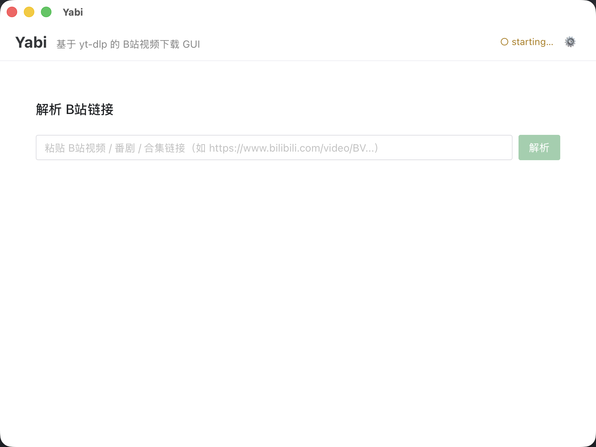

# Yabi

一个面向 macOS 桌面的 B站视频下载工具。基于开源的 [`yt-dlp`](https://github.com/yt-dlp/yt-dlp) 下载能力，包装成更易用、更好看的图形界面（GUI）应用。



  

## 架构

```
Yabi.app/Contents/MacOS/
├── yabi          # Tauri 2 (Rust) 壳 + Vue 3 + TS + Naive UI 前端
└── yabi-sidecar  # PyInstaller --onefile：yt-dlp + ffmpeg
```

三层之间用 **JSONL over stdio** 通信。下载进度由 `yt-dlp` 的 `progress_hooks` 推到 Python 工作线程，加锁写到 stdout，Rust 监听协程按行解析，转成 Tauri event 给前端实时更新。

## 功能

- URL 粘贴 → 视频解析（标题、UP 主、缩略图、时长）
- 格式列表展示（清晰度、容器、编码、大小）
- 一键下载，实时进度条 + 速度 + 剩余时间
- 取消下载
- 完成后"在 Finder 中显示"
- **合集 / 番剧批量下载**：解析合集后多选分集 + 选清晰度（best / ≤1080p / ≤720p / ≤480p / ≤360p）→ 顺序排队下载
- **浏览器 Cookies 导入**：在设置里选 Safari / Chrome / Firefox / Edge / Brave / Chromium，让 yt-dlp 复用浏览器登录态，解锁会员清晰度（1080P 高码率、1080P 高清等需大会员的清晰度）
- 下载目录设置（localStorage 持久化）
- ffmpeg 自动捆绑（imageio-ffmpeg）—— 用户无需自己装

## 本地开发

需要：Rust（stable）、Node LTS、Python 3.9+。

```bash
# 一次性：装 Python 依赖（yt-dlp + ffmpeg + pyinstaller）
python3 -m venv .venv
.venv/bin/python -m pip install -r requirements.txt

# 一次性：装 npm 依赖
npm install

# 每次代码改动后：打包 sidecar
bash sidecar/build.sh

# 开发模式（热重载）
npm run tauri dev

# 打包发布
npm run tauri build
# 产物：src-tauri/target/release/bundle/{macos/Yabi.app, dmg/Yabi_*.dmg}
```

## 安装

发布版本（macOS arm64，Apple Silicon）：

1. 从 [Releases](https://github.com/albertma-code/Yabi/releases) 下载 `Yabi_<version>_aarch64.dmg`
2. 打开 DMG，把 `Yabi.app` 拖到"应用程序"
3. 首次启动如果 macOS 提示「无法验证开发者」：右键 → 打开 → 仍然打开（Yabi 使用本机 ad-hoc 签名，未注册 Apple Developer 程序）

## 安全与隐私

不要提交以下内容：

- B站 cookies
- 登录态导出的浏览器数据
- 私有下载链接
- 本机真实下载目录中的视频文件
- 含个人信息的日志

仓库已默认忽略 `downloads/`、`.venv/`、`node_modules/`、`src-tauri/target/`、`src-tauri/binaries/*-*`、各种 cookies/cookie 文件名等。

## 许可证

本项目基于 [MIT](LICENSE) 许可证开源。

下载能力由 [`yt-dlp`](https://github.com/yt-dlp/yt-dlp) 提供（其自身的许可证适用）。Yabi 仅为其提供图形界面封装。
